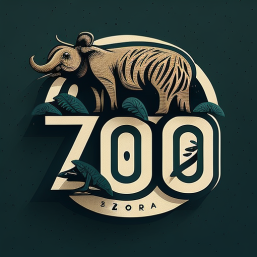
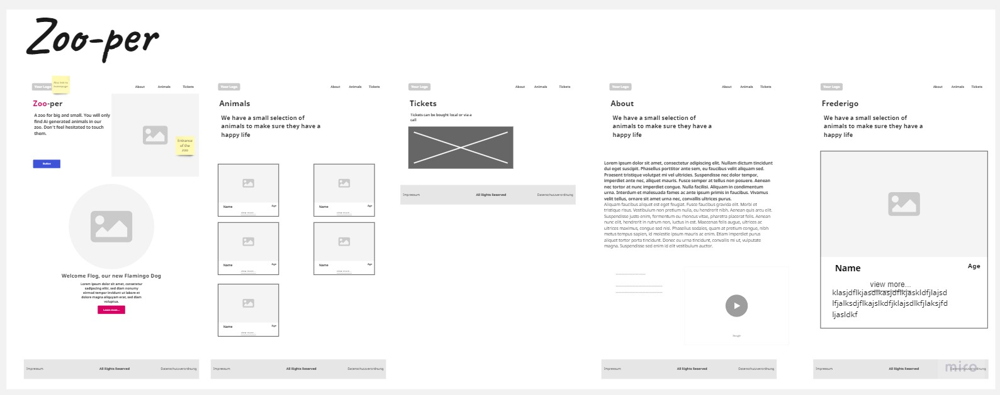

<br/>
<p align="center">
  <a href="https://github.com/NinoHelfenstein/ M293-Zoo-per">
    
  </a>

  <h3 align="center">M293-Zoo-per</h3>

  <p align="center">
    This project is about developing a website about a zoo. I've choosen a zoo which only has victious animals. All my choosen animals are AI Generated by Midjourney. I've choosen MVP.css as a stylesheet.
    <br/>
    <br/>
    <a href="https://github.com/NinoHelfenstein/M293-Zoo-per/issues">Report Bug</a>
  </p>
</p>

## Table Of Contents

- [Table Of Contents](#table-of-contents)
- [About The Project](#about-the-project)
- [File Structure](#file-structure)
- [Built With](#built-with)
- [Getting Started](#getting-started)
- [License](#license)
- [Authors](#authors)

## About The Project



This project is about developing a website about a zoo. I've choosen a zoo which only has victious animals. All my choosen animals are AI Generated by [Midjourney](http://midjouney.com). I've choosen [MVP.css](https://andybrewer.github.io/mvp/) as a stylesheet.

## File Structure

```
M293-Zoo-per
├── assets
│   ├── emaeaehnuel-lasker.png
│   ├── flecko.png
│   ├── flog.png
│   ├── logo.png
│   ├── rooster-coleman.png
│   ├── usain-blob.png
│   └── zooEntrance.jpg
├── components
│   ├── animal.js
│   ├── footer.js
│   └── nav.js
├── src
│   ├── about
│   │   └── about.html
│   ├── animals
│   │   ├── animals.html
│   │   ├── emaeaehnuel-lasker.html
│   │   ├── flecko.html
│   │   ├── flog.html
│   │   ├── rooster-coleman.html
│   │   ├── style.css
│   │   └── usain-blob.html
│   ├── contact
│   │   └── contact.html
│   ├── index
│   │   ├── index.html
│   │   └── style.css
│   ├── tickets
│   │   ├── style.css
│   │   └── tickets.html
│   ├── globalstyling.css
│   └── mvp.css
├── .gitattributes
├── LICENSE.md
├── README.md
└── wireframe.jpg
```

## Built With

It just built with plain HTML & CSS. The only thing which got added is the mvp.css stylesheet.

## Getting Started

The get the project running you just need to download the repo and open the src/index/index.html file

## License

Distributed under the MIT License. See [LICENSE](https://github.com/NinoHelfenstein/M293-Zoo-per/blob/main/LICENSE.md) for more information.

## Authors

- **Nino Helfenstein** - _Apprentice Software Developer_ - [Nino Helfenstein](https://github.com/NinoHelfenstein/)
